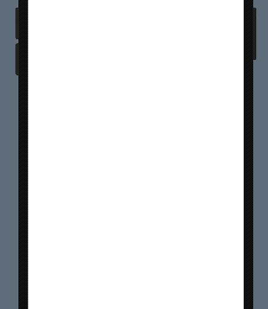
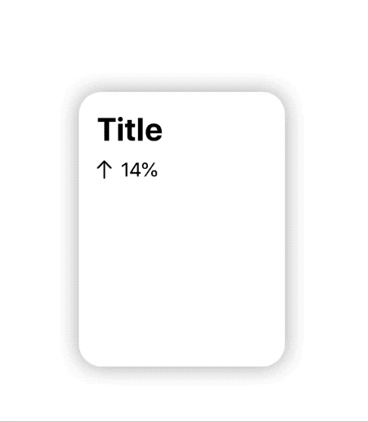
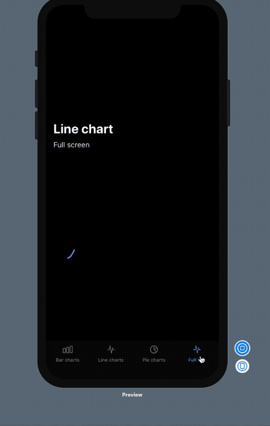
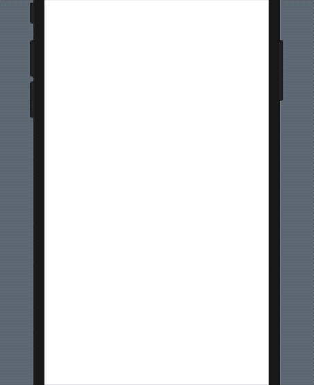
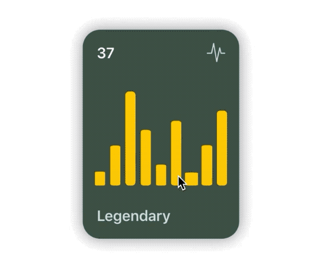
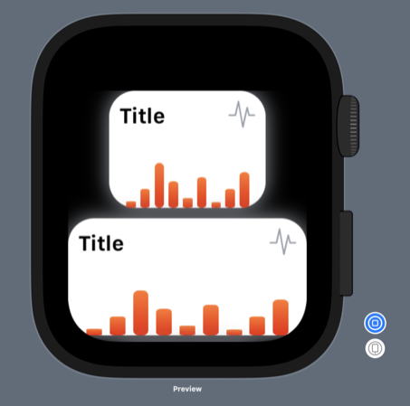

# SwiftUICharts

Swift package for displaying charts effortlessly.

**V2 Beta 1 is released, if you would like to try it out you can find a [demo project here](https://github.com/AppPear/ChartViewV2Demo)**

**iOS 14 WidgetKit support is coming. In V2 I will update current charts and possibly extend with some new chart types to provide the best support for building informative and beautiful widgets for the new home screen 🥳 Stay tuned!** 



### Note: 
**A version 2.0 is coming soon!!! 🎉🎉🎉**, so please hold off your PRs for a while. I'm writing a new code base with more sleek code architecture with an option for easier expansion. I'll make beta releases so you can test betas. 
**If you'd like to contribute you can find tickets for the new version in the Issues under the `v2` tag, please read more at: [https://github.com/AppPear/ChartView/pull/89](https://github.com/AppPear/ChartView/pull/89)**

It supports:
* Line charts
* Bar charts
* Pie charts

### Slack
Join our Slack channel for day to day conversation and more insights:

[Slack invite link](https://join.slack.com/t/swiftuichartview/shared_invite/zt-g6mxioq8-j3iUTF1YKX7D23ML3qcc4g)

### Installation:

It requires iOS 13 and Xcode 11!

In Xcode go to `File -> Swift Packages -> Add Package Dependency` and paste in the repo's url: `https://github.com/AppPear/ChartView`

### Usage:

import the package in the file you would like to use it: `import SwiftUICharts`

You can display a Chart by adding a chart view to your parent view: 

### Demo

Added an example project, with **iOS, watchOS** target: https://github.com/AppPear/ChartViewDemo

## Line charts

**LineChartView with multiple lines!**
First release of this feature, interaction is disabled for now, I'll figure it out how could be the best to interact with multiple lines with a single touch.


Usage:
```swift
MultiLineChartView(data: [([8,32,11,23,40,28], GradientColors.green), ([90,99,78,111,70,60,77], GradientColors.purple), ([34,56,72,38,43,100,50], GradientColors.orngPink)], title: "Title")
```
Gradient colors are now under the `GradientColor` struct you can create your own gradient by `GradientColor(start: Color, end: Color)`

Available preset gradients: 
* orange 
* blue
* green
* blu 
* bluPurpl
* purple
* prplPink 
* prplNeon
* orngPink

**Full screen view called LineView!!!**



```swift
 LineView(data: [8,23,54,32,12,37,7,23,43], title: "Line chart", legend: "Full screen") // legend is optional, use optional .padding()
```

Adopts to dark mode automatically 


You can add your custom darkmode style by specifying:

```swift
let myCustomStyle = ChartStyle(...)
let myCutsomDarkModeStyle = ChartStyle(...)
myCustomStyle.darkModeStyle = myCutsomDarkModeStyle
```

**Line chart is interactive, so you can drag across to reveal the data points**

You can add a line chart with the following code: 

```swift
 LineChartView(data: [8,23,54,32,12,37,7,23,43], title: "Title", legend: "Legendary") // legend is optional
```

**Turn drop shadow off by adding to the Initialiser: `dropShadow: false`**


## Bar charts


**[New feature] you can display labels also along values and points for each bar to descirbe your data better!**
**Bar chart is interactive, so you can drag across to reveal the data points**

You can add a bar chart with the following code: 

Labels and points:

```swift
 BarChartView(data: ChartData(values: [("2018 Q4",63150), ("2019 Q1",50900), ("2019 Q2",77550), ("2019 Q3",79600), ("2019 Q4",92550)]), title: "Sales", legend: "Quarterly") // legend is optional
```
Only points:

```swift
 BarChartView(data: ChartData(points: [8,23,54,32,12,37,7,23,43]), title: "Title", legend: "Legendary") // legend is optional
```

**ChartData** structure
Stores values in data pairs (actually tuple): `(String,Double)`
* you can have duplicate values
* keeps the data order

You can initialise ChartData multiple ways:
* For integer values: `ChartData(points: [8,23,54,32,12,37,7,23,43])`
* For floating point values: `ChartData(points: [2.34,3.14,4.56])`
* For label,value pairs: `ChartData(values: [("2018 Q4",63150), ("2019 Q1",50900)])`


You can add different formats: 
* Small `ChartForm.small`
* Medium  `ChartForm.medium`
* Large `ChartForm.large` 

```swift
BarChartView(data: ChartData(points: [8,23,54,32,12,37,7,23,43]), title: "Title", form: ChartForm.small)
```

For floating point numbers, you can set a custom specifier: 

```swift
BarChartView(data: ChartData(points:[1.23,2.43,3.37]) ,title: "A", valueSpecifier: "%.2f")
```
For integers you can disable by passing: `valueSpecifier: "%.0f"`


You can set your custom image in the upper right corner by passing in the initialiser: `cornerImage:Image(systemName: "waveform.path.ecg")` 


 **Turn drop shadow off by adding to the Initialiser: `dropShadow: false`**

 ### You can customize styling of the chart with a ChartStyle object: 

Customizable: 
* background color
* accent color
* second gradient color
* text color
* legend text color

```swift
 let chartStyle = ChartStyle(backgroundColor: Color.black, accentColor: Colors.OrangeStart, secondGradientColor: Colors.OrangeEnd, chartFormSize: ChartForm.medium, textColor: Color.white, legendTextColor: Color.white )
 ...
 BarChartView(data: [8,23,54,32,12,37,7,23,43], title: "Title", style: chartStyle)
```

You can access built-in styles: 
```swift
 BarChartView(data: [8,23,54,32,12,37,7,23,43], title: "Title", style: Styles.barChartMidnightGreen)
```
#### All styles available as a preset: 
* barChartStyleOrangeLight
* barChartStyleOrangeDark
* barChartStyleNeonBlueLight
* barChartStyleNeonBlueDark
* barChartMidnightGreenLight
* barChartMidnightGreenDark




### You can customize the size of the chart with a ChartForm object: 

**ChartForm**
* `.small`
* `.medium`
* `.large`
* `.detail`

```swift
BarChartView(data: [8,23,54,32,12,37,7,23,43], title: "Title", form: ChartForm.small)
```

### You can choose whether bar is animated or not after completing your gesture.

If you want to animate back movement after completing your gesture, you set `animatedToBack` as `true`. 

### WatchOS support for Bar charts: 



## Pie charts


You can add a pie chart with the following code: 

```swift
 PieChartView(data: [8,23,54,32], title: "Title", legend: "Legendary") // legend is optional
```

**Turn drop shadow off by adding to the Initialiser: `dropShadow: false`**

