# SwiftUICharts

### SwiftUICharts is here with a new version, giving more controll and customization over the charts and full ios 13 backwards compatibility.

SwiftUICharts is an open source library for creating charts in iOS apps with SwiftUI. Built natively with SwiftUI in mind and it is fully compatible with the latest versions of iOS, also backwards **compatible up to iOS 13.**

With SwiftUICharts, you can easily create a variety of chart types, including line charts, bar charts, ring charts and pie charts. It also provides additional chart types and customization options, giving you the flexibility to create charts that perfectly fit your needs.

In addition to its native SwiftUI integration, backwards compatibility and wide range of chart types, SwiftUICharts is also easy to use, making it a great choice for creating stunning and intuitive charts in your applications.

<p align="center">
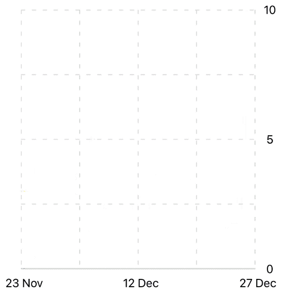 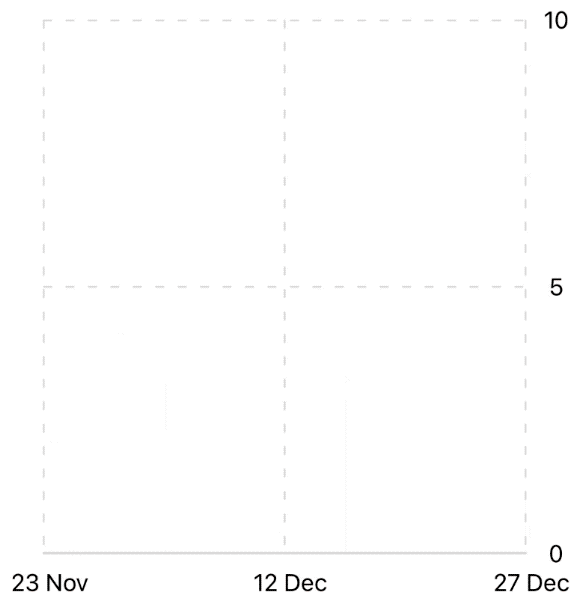 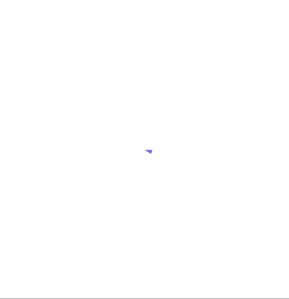
</p>

### Composable

You can now build your custom chart from prebuilt layers. Use a simple chart, add background grids, add chart labels to the axes, add tcks to the line, etc.

### Works great with native SwiftUI elements

[Example codes here](./example.md)
<p align="left">
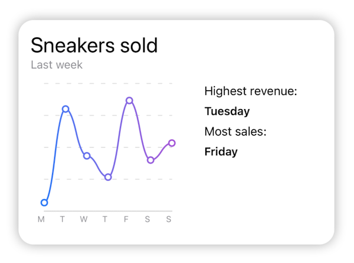 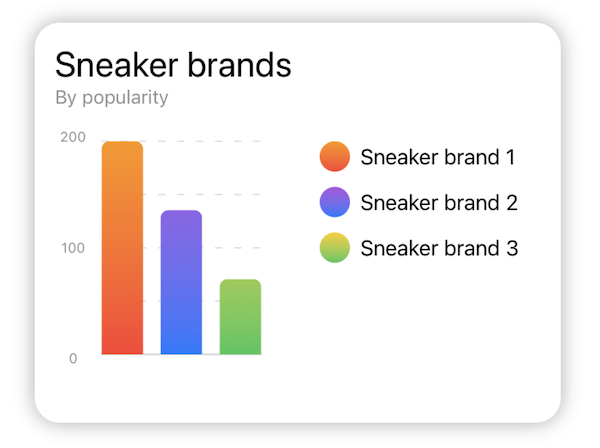 
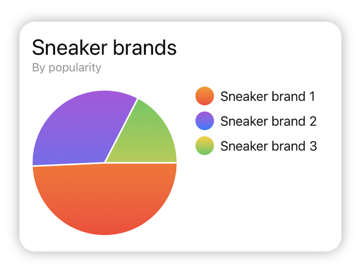
</p>

### Installation

It is a SPM package, in Xcode go to File -> Swift Packages -> Add Package Dependency and paste in the repo's url: https://github.com/AppPear/ChartView

if you want to add previous releases you can find release tags https://github.com/AppPear/ChartView/releases

### Slack

Join our Slack channel for day to day conversation and more insights:

https://join.slack.com/t/swiftuichartview/shared_invite/zt-g6mxioq8-j3iUTF1YKX7D23ML3qcc4g

## Quick start guide: 

**Create a simple chart:**

<p align="left">
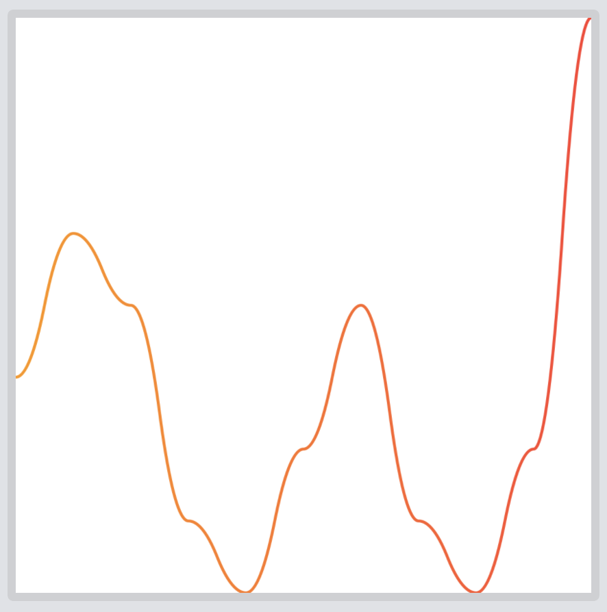
</p>

```swift
LineChart()
    .data([3, 5, 4, 1, 0, 2, 4, 1, 0, 2, 8])
    .chartStyle(ChartStyle(backgroundColor: .white, foregroundColor: ColorGradient(.orange, .red)))
```

**Add a background grid to the chart:**

<p align="left">
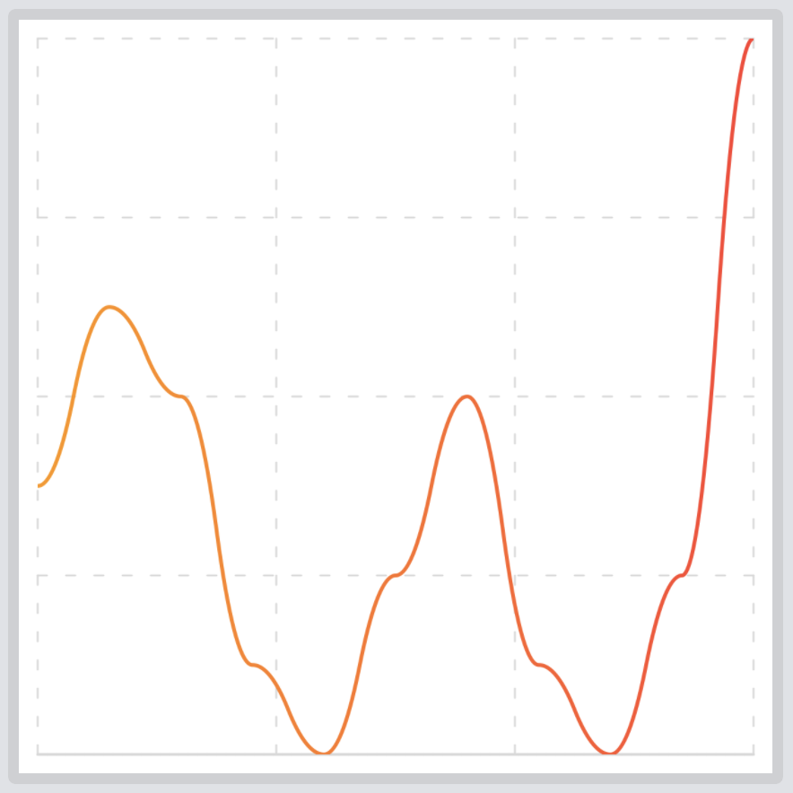
</p>

```swift
ChartGrid {
    LineChart()
        .data([3, 5, 4, 1, 0, 2, 4, 1, 0, 2, 8])
        .chartStyle(ChartStyle(backgroundColor: .white, foregroundColor: ColorGradient(.orange, .red)))
}
.setNumberOfHorizontalLines(5)
.setNumberOfVerticalLines(4)
```

**Add a axis label to the chart:**

<p align="left">
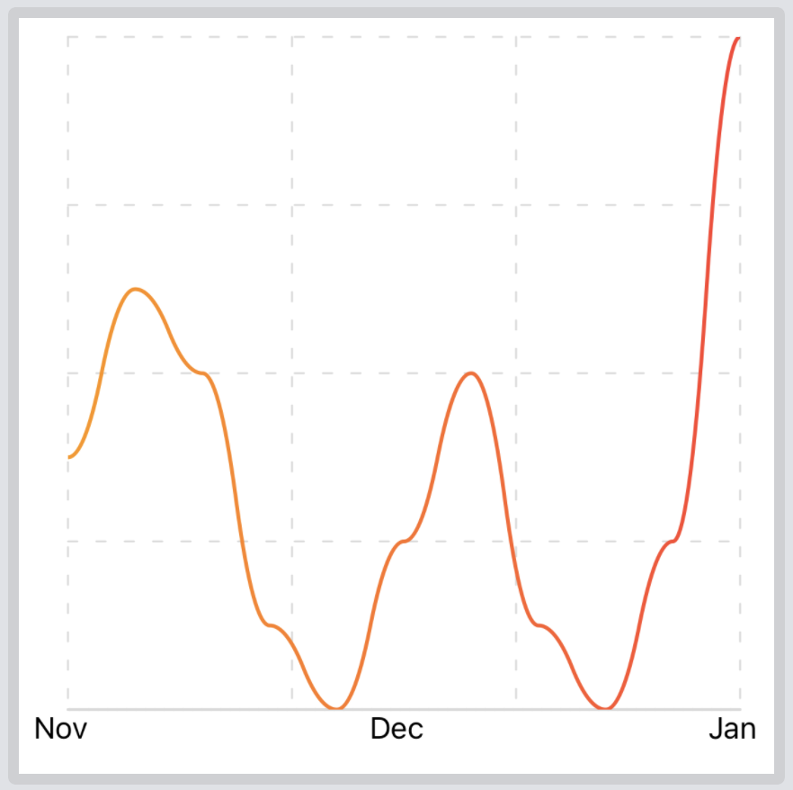
</p>

```swift
AxisLabels {
    ChartGrid {
        LineChart()
            .data([3, 5, 4, 1, 0, 2, 4, 1, 0, 2, 8])
            .chartStyle(ChartStyle(backgroundColor: .white, foregroundColor: ColorGradient(.orange, .red)))
    }
    .setNumberOfHorizontalLines(5)
    .setNumberOfVerticalLines(4)
}
.setAxisXLabels([(1, "Nov"), (2, "Dec"), (3, "Jan")], range: 1...3)
```

**Show chart marks on the line:**

<p align="left">
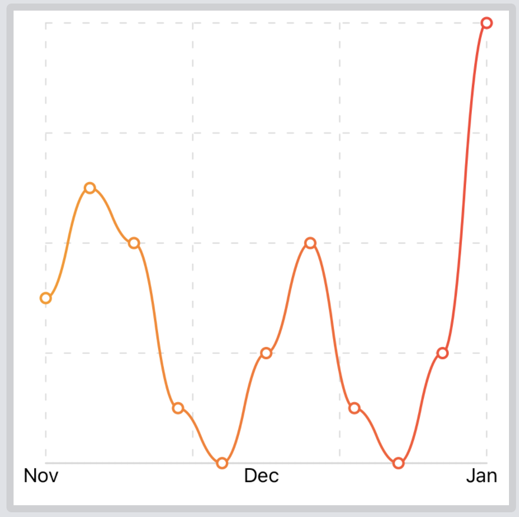
</p>

```swift
AxisLabels {
    ChartGrid {
        LineChart()
            .showChartMarks(true)
            .data([3, 5, 4, 1, 0, 2, 4, 1, 0, 2, 8])
            .chartStyle(ChartStyle(backgroundColor: .white, foregroundColor: ColorGradient(.orange, .red)))
    }
    .setNumberOfHorizontalLines(5)
    .setNumberOfVerticalLines(4)
}
.setAxisXLabels([(1, "Nov"), (2, "Dec"), (3, "Jan")], range: 1...3)
```

**Apply custom ranges on chart**

<p align="left">
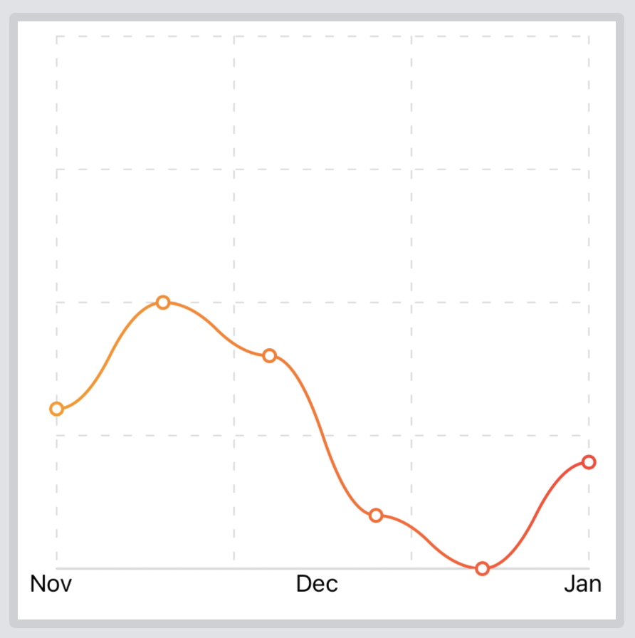
</p>

```swift
AxisLabels {
    ChartGrid {
        LineChart()
            .showChartMarks(true)
            .data([3, 5, 4, 1, 0, 2, 4, 1, 0, 2, 8])
            .rangeY(0...10)
            .rangeX(0...5)
            .chartStyle(ChartStyle(backgroundColor: .white, foregroundColor: ColorGradient(.orange, .red)))
    }
    .setNumberOfHorizontalLines(5)
    .setNumberOfVerticalLines(4)
}
.setAxisXLabels([(1, "Nov"), (2, "Dec"), (3, "Jan")], range: 1...3)
```

**Add multiple charts in the same frame**

<p align="left">
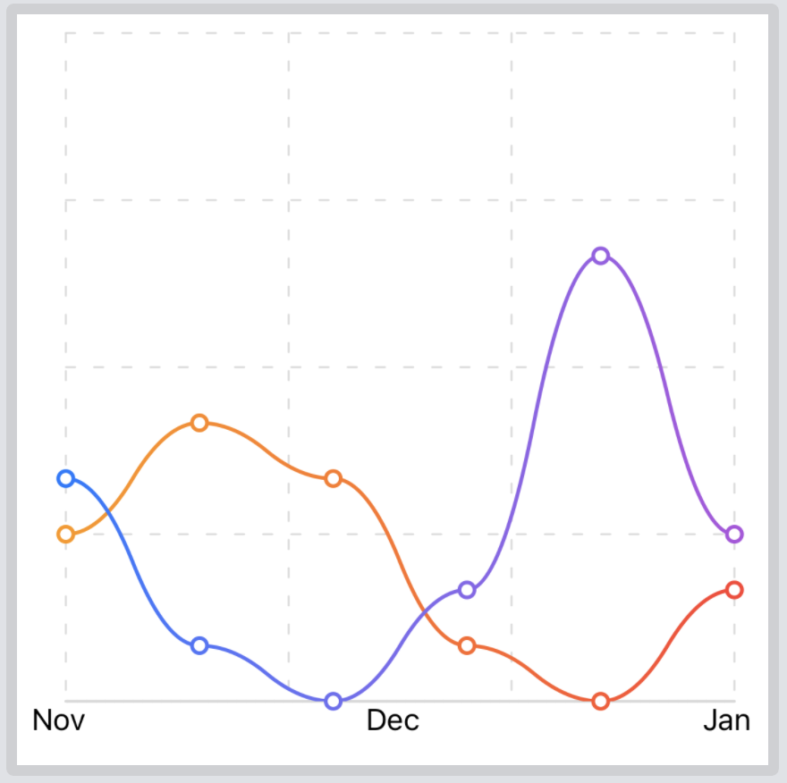
</p>

```swift
AxisLabels {
    ChartGrid {
        LineChart()
            .showChartMarks(true)
            .data([3, 5, 4, 1, 0, 2, 4, 1, 0, 2, 8])
            .rangeY(0...12)
            .rangeX(0...5)
            .chartStyle(ChartStyle(backgroundColor: .white, foregroundColor: ColorGradient(.orange, .red)))
        LineChart()
            .showChartMarks(true)
            .data([4, 1, 0, 2, 8, 3, 6, 1, 4])
            .rangeY(0...12)
            .rangeX(0...5)
            .chartStyle(ChartStyle(backgroundColor: .white, foregroundColor: ColorGradient(.blue, .purple)))
    }
    .setNumberOfHorizontalLines(5)
    .setNumberOfVerticalLines(4)
}
.setAxisXLabels([(1, "Nov"), (2, "Dec"), (3, "Jan")], range: 1...3)
```

**Combine chart types in the same frame**

<p align="left">
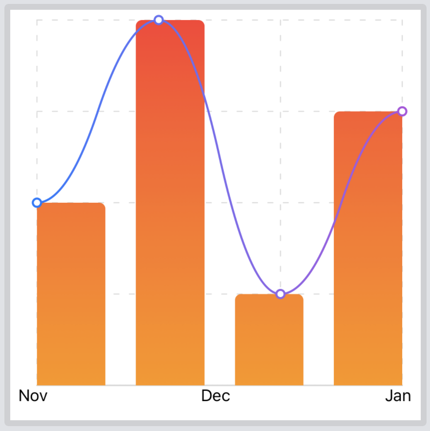
</p>

```swift
AxisLabels {
    ChartGrid {
        BarChart()
            .data([2, 4, 1, 3])
            .chartStyle(ChartStyle(backgroundColor: .white, foregroundColor: ColorGradient(.orange, .red)))
        LineChart()
            .showChartMarks(true)
            .data([2, 4, 1, 3])
            .chartStyle(ChartStyle(backgroundColor: .white, foregroundColor: ColorGradient(.blue, .purple)))
    }
    .setNumberOfHorizontalLines(5)
    .setNumberOfVerticalLines(4)
}
.setAxisXLabels([(1, "Nov"), (2, "Dec"), (3, "Jan")], range: 1...3)
```

