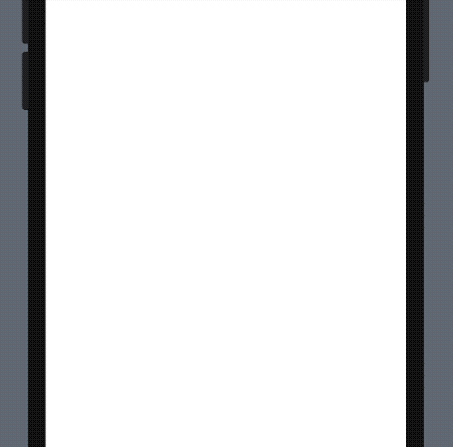
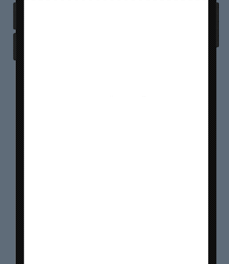
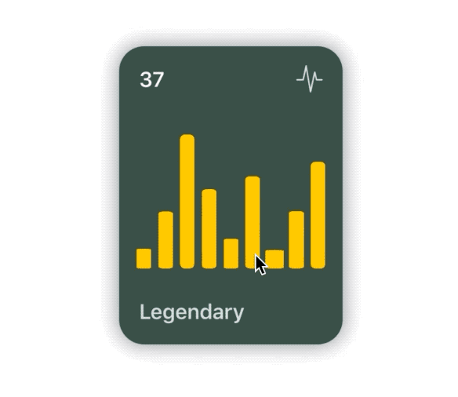
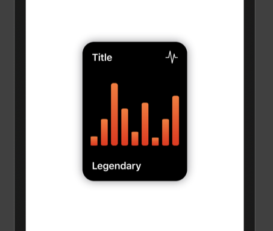
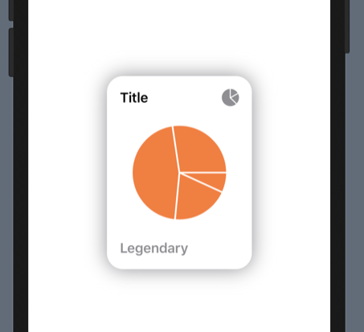

# SwiftUICharts

Swift package for displaying charts effortlessly.


It supports:
* Line charts
* Bar charts
* Pie charts

### Installation:

It requires iOS 13 and xCode 11!

In xCode got to `File -> Swift Packages -> Add Package Dependency` and paste inthe repo's url: `https://github.com/AppPear/ChartView`

### Usage:

import the package in the file you would like to use it: `import SwiftUICharts`

You can display a Chart by adding a chart view to your parent view: 

## Line charts


**Line chart is interactive, so you can drag across to reveal the data points**

You can add a line chart with the following code: 

```swift
 LineChartView(data: [8,23,54,32,12,37,7,23,43], title: "Title", legend: "Legendary") // legend is optional
```


## Bar charts


**Bar chart is interactive, so you can drag across to reveal the data points**

You can add a bar chart with the following code: 

```swift
 BarChartView(data: [8,23,54,32,12,37,7,23,43], title: "Title", legend: "Legendary") // legend is optional
```

You can add different formats: 
* Small `Form.small`
* Medium  `Form.medium`
* Large `Form.large` 

 ```swift
 BarChartView(data: [8,23,54,32,12,37,7,23,43], title: "Title", style: ChartStyle(formSize: Form.small))
 ```
 
 ### You can customize styling of the chart with a ChartStyle object: 

Customizable: 
* background color
* accent color
* second gradient color
* chart form size
* text color
* legend text color

```swift
 let chartStyle = ChartStyle(backgroundColor: Color.black, accentColor: Colors.OrangeStart, secondGradientColor: Colors.OrangeEnd, chartFormSize: Form.medium, textColor: Color.white, legendTextColor: Color.white )
 ...
 BarChartView(data: [8,23,54,32,12,37,7,23,43], title: "Title", style: chartStyle)
```

You can access built-in styles: 
```swift
 BarChartView(data: [8,23,54,32,12,37,7,23,43], title: "Title", style: Styles.barChartMidnightGreen)
```
#### All styles available as a preset: 
* barChartStyleOrangeLight
* barChartStyleOrangeDark
* barChartStyleNeonBlueLight
* barChartStyleNeonBlueDark
* barChartMidnightGreenLight
* barChartMidnightGreenDark






## Pie charts


You can add a line chart with the following code: 

```swift
 PieChartView(data: [8,23,54,32], title: "Title", legend: "Legendary") // legend is optional
```

