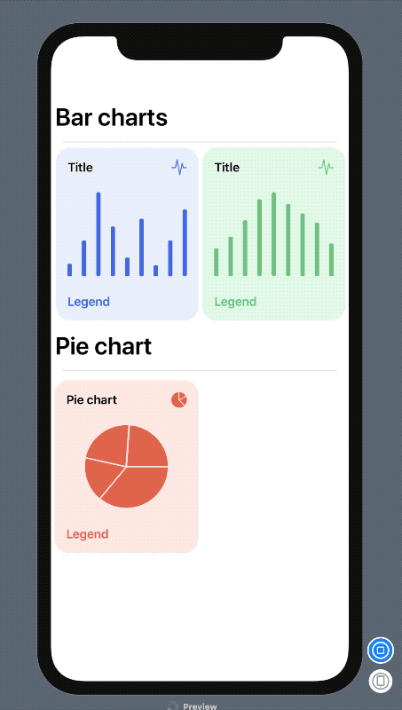

# SwiftUICharts

Swift package for displaying charts effortlessly.



It supports currently:
* barcharts
* piecharts

### Installation:

It requires iOS 13 and xCode 11!

In xCode got to `File -> Swift Packages -> Add Package Dependency` and paste inthe repo's url: `https://github.com/AppPear/ChartView`

### Usage:

import the package in the file you would like to use it: `import SwiftUICharts`

You can display a Chart by adding a chart view to your parent view: 

Barchart:
```swift
ChartView(data: [8,23,54,32,12,37,7,23,43], title: "Barchart")
```

Piechart:
```swift
PieChartView(data:[43,56,78,34], title: "Piechart")
```

You can optionally configure:
* legend
* background color
* accent color

```swift
ChartView(data: [12,17,24,33,36,31,27,23,14], title: "Title", legend: "Legend", backgroundColor:Color(red: 226.0/255.0, green: 250.0/255.0, blue: 231.0/255.0) , accentColor:Color(red: 114.0/255.0, green: 191.0/255.0, blue: 130.0/255.0))
```


