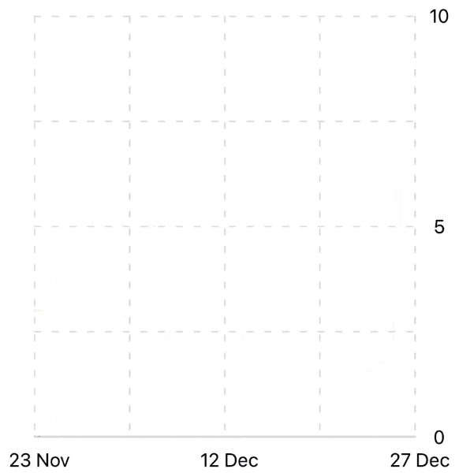
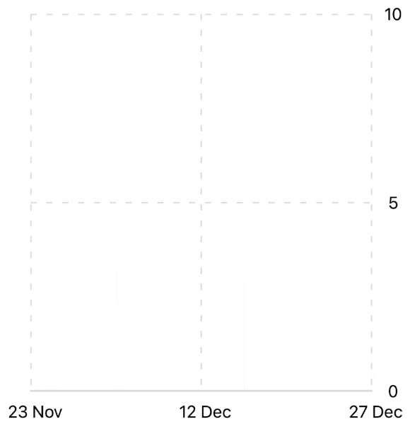

# SwiftUICharts

SwiftUICharts is a composable, SwiftUI-native chart library for iOS 13+.

`2.0.0` is a major release focused on immutable configuration, environment-driven composition, and modifier-based APIs.

<p align="center">
  
</p>

## AI Agent Quick Context

Use this section when an AI agent generates code against this package.

### API contract

- Use only `2.x` composable APIs.
- Do not use legacy `1.x` types or mutating chains.
- Build charts with `ViewModifier` composition.
- Keep data source semantics explicit:
  - `chartData([Double])` = categorical slots
  - `chartData([(Double, Double)])` = numeric/continuous domain

### Use these APIs

| Task | API |
| --- | --- |
| Set data | `chartData(...)` |
| Set ranges | `chartXRange(...)`, `chartYRange(...)` |
| Style chart | `chartStyle(...)` |
| Grid config | `chartGridLines`, `chartGridStroke`, `chartGridBaseline` |
| Axis labels/ticks | `chartXAxisLabels`, `chartYAxisLabels`, `chartXAxisAutoTicks`, `chartYAxisAutoTicks` |
| Line tuning | `chartLineWidth`, `chartLineStyle`, `chartLineMarks`, `chartLineAnimation` |
| Shared interaction | `chartInteractionValue(...)` |
| Callback interaction | `chartSelectionHandler { event in ... }` |
| Streaming data | `ChartStreamingDataSource` + `chartData(stream)` |
| Large datasets | `chartPerformance(...)` |

### Avoid these legacy APIs

- `LineChartView`, `BarChartView`, `PieChartView`, `MultiLineChartView`
- `.data(...)`, `.rangeX(...)`, `.rangeY(...)`
- `.setAxisXLabels(...)`, `.setNumberOfHorizontalLines(...)`
- `.showChartMarks(...)` (old form)

## Installation

Add with Swift Package Manager:

`https://github.com/AppPear/ChartView`

For this release, use tag `2.0.0` (or `from: "2.0.0"` up to next major).

## 30-Second Quick Start

```swift
import SwiftUI
import SwiftUICharts

struct DemoView: View {
    var body: some View {
        AxisLabels {
            ChartGrid {
                LineChart()
                    .chartData([12, 34, 23, 18, 36, 22, 26])
                    .chartYRange(10...40)
                    .chartLineMarks(true, color: ColorGradient(.blue, .purple))
                    .chartStyle(
                        ChartStyle(
                            backgroundColor: .white,
                            foregroundColor: ColorGradient(.blue, .purple)
                        )
                    )
            }
            .chartGridLines(horizontal: 5, vertical: 6)
        }
        .chartXAxisLabels(["M", "T", "W", "T", "F", "S", "S"])
        .chartAxisColor(.secondary)
        .chartAxisFont(.caption)
        .frame(height: 220)
        .padding()
    }
}
```

## Feature Recipes

### 1) Mixed bar + line

```swift
AxisLabels {
    ChartGrid {
        BarChart()
            .chartData([2, 4, 1, 3, 5])
            .chartStyle(ChartStyle(backgroundColor: .white,
                                   foregroundColor: ColorGradient(.orange, .red)))

        LineChart()
            .chartData([2, 4, 1, 3, 5])
            .chartLineMarks(true)
            .chartStyle(ChartStyle(backgroundColor: .white,
                                   foregroundColor: ColorGradient(.blue, .purple)))
    }
    .chartGridLines(horizontal: 5, vertical: 5)
}
.chartXAxisLabels([(0, "A"), (1, "B"), (2, "C"), (3, "D"), (4, "E")], range: 0...4)
```

### 2) Shared interaction state

```swift
let selected = ChartValue()

VStack(alignment: .leading) {
    ChartLabel("Weekly Sales", type: .title)
    ChartLabel("Drag bars", type: .legend, format: "%.1f")

    BarChart().chartData([14, 22, 18, 31, 26, 19, 24])
}
.chartInteractionValue(selected)
```

### 3) Callback-based interaction

```swift
BarChart()
    .chartData([8, 11, 13, 9, 12])
    .chartSelectionHandler { event in
        guard event.isActive,
              let value = event.value,
              let index = event.index else { return }
        print("selected", index, value)
    }
```

### 4) Dynamic streaming data

```swift
@ObservedObject private var stream = ChartStreamingDataSource(
    initialValues: [18, 23, 20, 27, 29, 24],
    windowSize: 6,
    autoScroll: true
)

LineChart()
    .chartData(stream)
    .chartYRange(stream.suggestedYRange)
```

### 5) Performance mode for large datasets

```swift
LineChart()
    .chartData(largeSeries)
    .chartPerformance(.automatic(threshold: 600,
                                 maxPoints: 180,
                                 simplifyLineStyle: true))
```

## Migration

This is a major breaking release.

- Full migration guide: [MIGRATION.md](./MIGRATION.md)
- Quick examples: [example.md](./example.md)

## Documentation Map

- Wiki index: [docs/wiki/README.md](./docs/wiki/README.md)
- Getting started: [docs/wiki/01-getting-started.md](./docs/wiki/01-getting-started.md)
- Modifiers: [docs/wiki/02-composable-modifiers.md](./docs/wiki/02-composable-modifiers.md)
- Interaction: [docs/wiki/03-interaction-and-selection.md](./docs/wiki/03-interaction-and-selection.md)
- Streaming: [docs/wiki/04-dynamic-and-streaming-data.md](./docs/wiki/04-dynamic-and-streaming-data.md)
- Performance: [docs/wiki/05-performance-and-large-datasets.md](./docs/wiki/05-performance-and-large-datasets.md)
- Axis alignment: [docs/wiki/06-unified-axis-and-label-alignment.md](./docs/wiki/06-unified-axis-and-label-alignment.md)
- Migration summary: [docs/wiki/07-migration-from-1x.md](./docs/wiki/07-migration-from-1x.md)

## Example App

The showcase app demonstrates all major features:

`Examples/SwiftUIChartsShowcase`

## Release Notes

- Changelog: [CHANGELOG.md](./CHANGELOG.md)
- Includes Apple privacy manifest: `Sources/SwiftUICharts/PrivacyInfo.xcprivacy`
