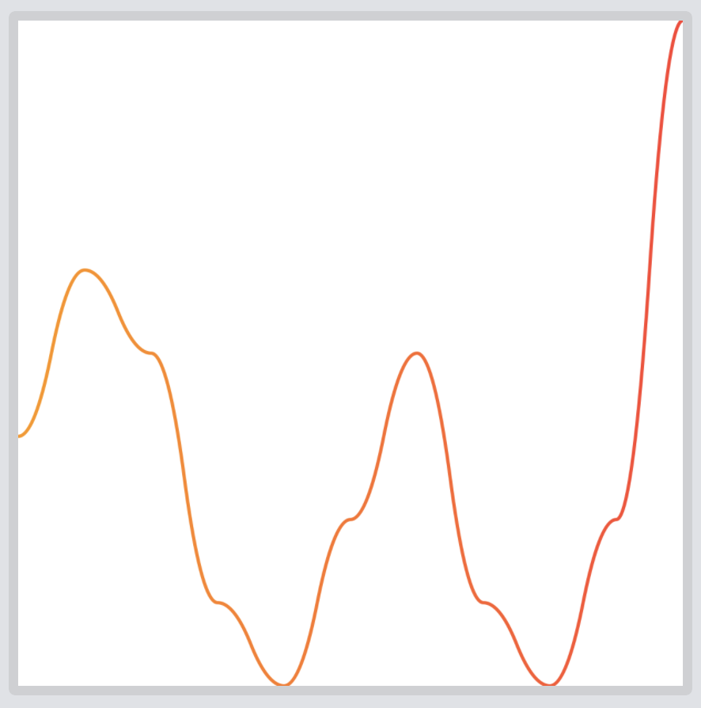
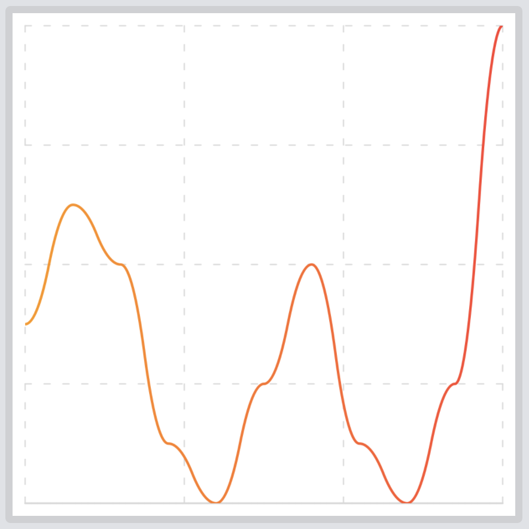
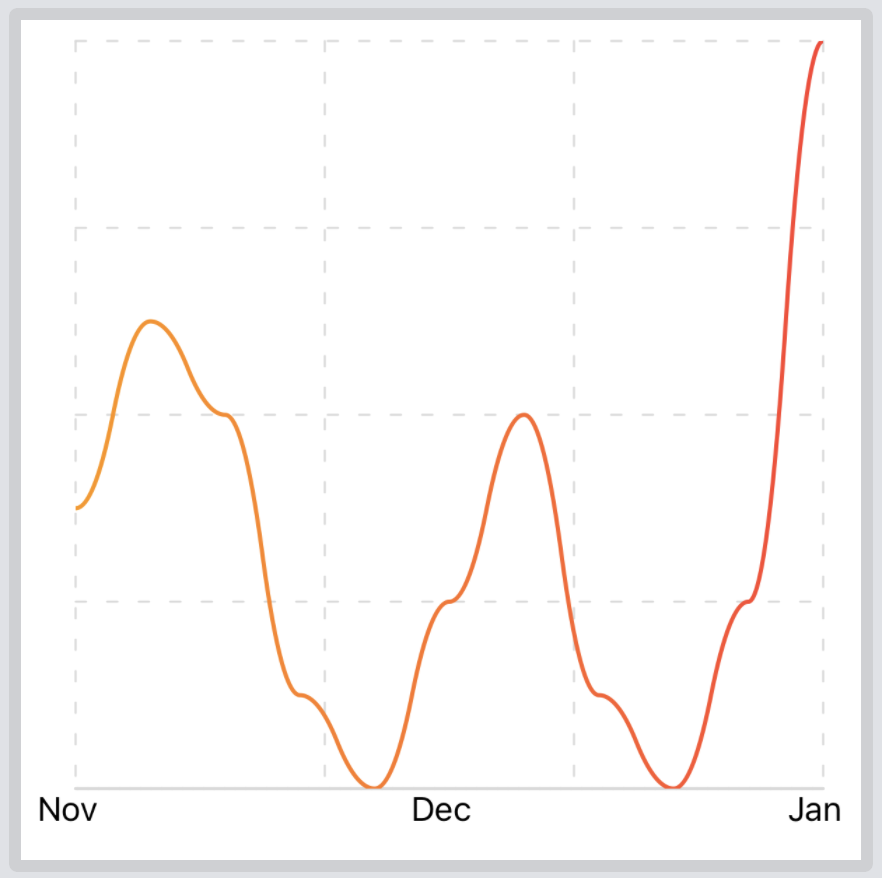
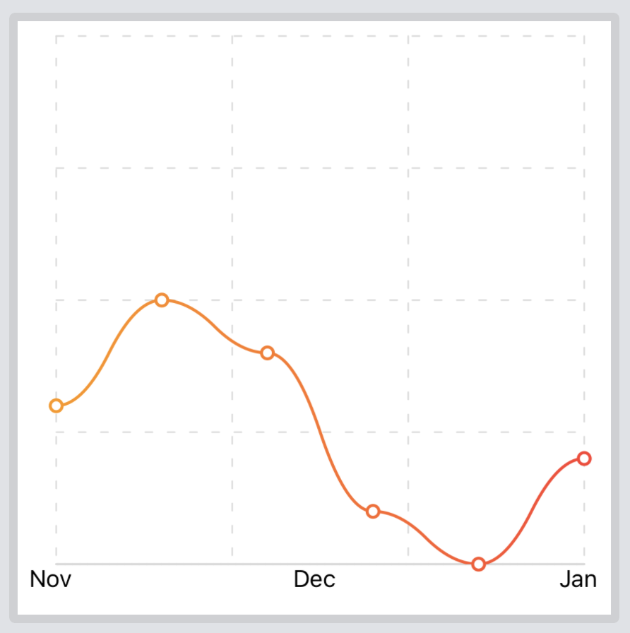
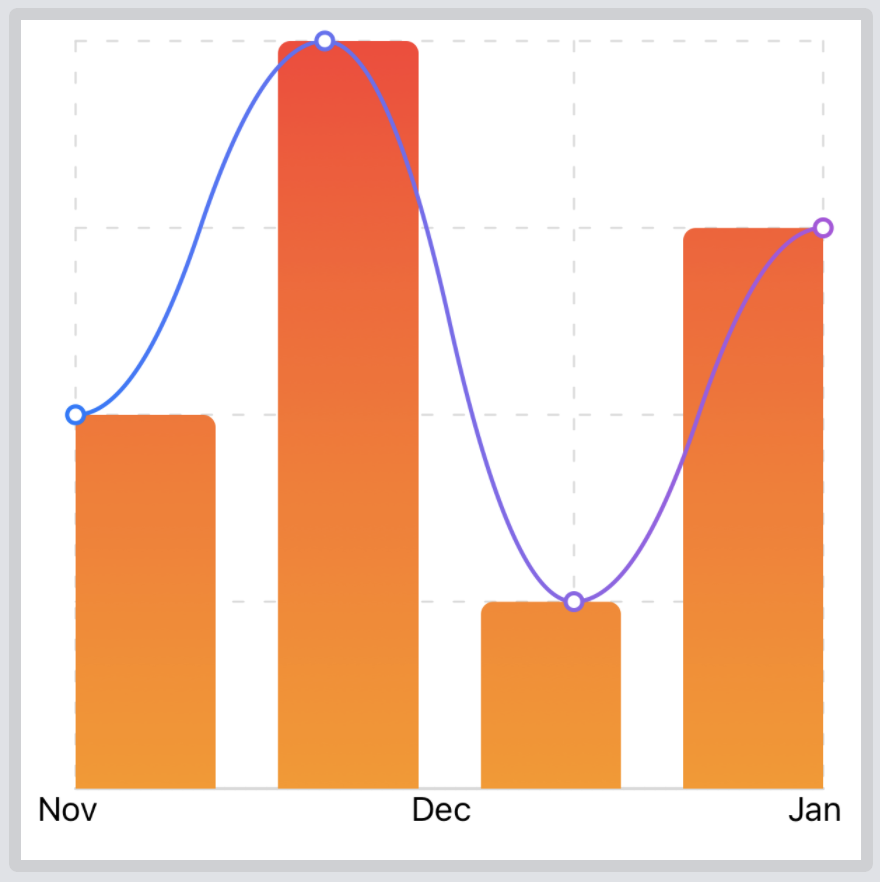

# SwiftUICharts

SwiftUICharts is an open-source chart library for SwiftUI with iOS 13 compatibility.

This release uses a fully composable, SwiftUI-idiomatic API based on immutable configuration and `ViewModifier` chains.

<p align="center">
  
</p>

## Charts

- `LineChart`
- `BarChart`
- `PieChart`
- `RingsChart`

## Installation

Use Swift Package Manager in Xcode and add:

`https://github.com/AppPear/ChartView`

## Migration

This is a major composable API release.

- Previous chain APIs like `.data`, `.rangeX`, `.rangeY`, `.setAxisXLabels`, `.setNumberOfHorizontalLines`, and line-specific setters were replaced by typed chart modifiers.
- Full old-to-new mapping: [MIGRATION.md](./MIGRATION.md)

## Quick Start

**Simple line chart**

<p align="left">

</p>

```swift
LineChart()
    .chartData([3, 5, 4, 1, 0, 2, 4, 1, 0, 2, 8])
    .chartStyle(ChartStyle(backgroundColor: .white, foregroundColor: ColorGradient(.orange, .red)))
```

**Add background grid**

<p align="left">

</p>

```swift
ChartGrid {
    LineChart()
        .chartData([3, 5, 4, 1, 0, 2, 4, 1, 0, 2, 8])
        .chartStyle(ChartStyle(backgroundColor: .white, foregroundColor: ColorGradient(.orange, .red)))
}
.chartGridLines(horizontal: 5, vertical: 4)
```

**Axis labels**

<p align="left">

</p>

```swift
AxisLabels {
    ChartGrid {
        LineChart()
            .chartData([3, 5, 4, 1, 0, 2, 4, 1, 0, 2, 8])
            .chartStyle(ChartStyle(backgroundColor: .white, foregroundColor: ColorGradient(.orange, .red)))
    }
    .chartGridLines(horizontal: 5, vertical: 4)
}
.chartXAxisLabels([(1, "Nov"), (2, "Dec"), (3, "Jan")], range: 1...3)
```

**Line config + ranges**

<p align="left">

</p>

```swift
AxisLabels {
    ChartGrid {
        LineChart()
            .chartLineMarks(true)
            .chartData([3, 5, 4, 1, 0, 2, 4, 1, 0, 2, 8])
            .chartYRange(0...10)
            .chartXRange(0...5)
            .chartStyle(ChartStyle(backgroundColor: .white, foregroundColor: ColorGradient(.orange, .red)))
    }
    .chartGridLines(horizontal: 5, vertical: 4)
}
.chartXAxisLabels([(1, "Nov"), (2, "Dec"), (3, "Jan")], range: 1...3)
```

**Mix chart types**

<p align="left">

</p>

```swift
AxisLabels {
    ChartGrid {
        BarChart()
            .chartData([2, 4, 1, 3])
            .chartStyle(ChartStyle(backgroundColor: .white, foregroundColor: ColorGradient(.orange, .red)))

        LineChart()
            .chartLineMarks(true)
            .chartData([2, 4, 1, 3])
            .chartStyle(ChartStyle(backgroundColor: .white, foregroundColor: ColorGradient(.blue, .purple)))
    }
    .chartGridLines(horizontal: 5, vertical: 4)
}
.chartXAxisLabels([(1, "Nov"), (2, "Dec"), (3, "Jan")], range: 1...3)
```

## Full Examples

See [example.md](./example.md) and [`Examples/SwiftUIChartsShowcase`](./Examples/SwiftUIChartsShowcase) for complete showcase code.
