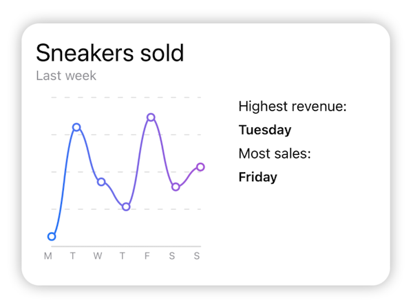
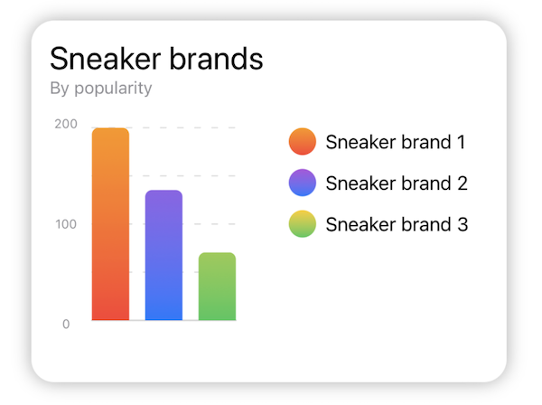
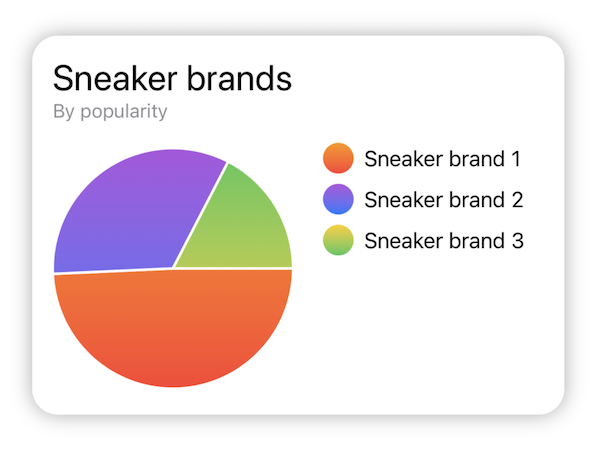

# SwiftUICharts

### Example codes (modifier-based composable API)

<p align="left">

</p>

```swift
import SwiftUI
import SwiftUICharts

struct DemoView: View {
    var body: some View {
        VStack(alignment: .leading) {
            Text("Sneakers sold")
                .font(.title)
            Text("Last week")
                .font(.subheadline)
                .foregroundColor(.gray)
                .padding(.bottom, 8.0)
            HStack {
                AxisLabels {
                    ChartGrid {
                        LineChart()
                            .chartLineMarks(true)
                            .chartYRange(10...40)
                            .chartData([12, 34, 23, 18, 36, 22, 26])
                            .chartStyle(ChartStyle(backgroundColor: .white,
                                                   foregroundColor: ColorGradient(.blue, .purple)))
                    }
                    .chartGridLines(horizontal: 5, vertical: 0)
                }
                .chartXAxisLabels([(1, "M"), (2, "T"), (3, "W"), (4, "T"), (5, "F"), (6, "S"), (7, "S")],
                                  range: 1...7)
                .chartAxisColor(.gray)
                .chartAxisFont(.caption)

                VStack(alignment: .leading, spacing: 8.0) {
                    Text("Highest revenue:")
                        .font(.callout)
                    Text("Tuesday")
                        .font(.subheadline)
                        .bold()

                    Text("Most sales:")
                        .font(.callout)
                    Text("Friday")
                        .font(.subheadline)
                        .bold()
                    Spacer()
                }
                .frame(maxWidth: .infinity)
            }
        }
        .padding(16.0)
        .background(RoundedRectangle(cornerRadius: 20)
            .fill(.white)
            .shadow(radius: 8.0))
        .padding(32)
        .frame(width: 450, height: 350)
    }
}
```

<p align="left">

</p>

```swift
import SwiftUI
import SwiftUICharts

struct DemoView: View {
    let chartValue = ChartValue()

    var body: some View {
        VStack(alignment: .leading) {
            Text("Sneaker brands")
                .font(.title)
            Text("By popularity")
                .font(.subheadline)
                .foregroundColor(.gray)
                .padding(.bottom, 8.0)
            HStack {
                AxisLabels {
                    ChartGrid {
                        BarChart()
                            .chartData([34, 23, 12])
                            .chartStyle(ChartStyle(backgroundColor: .white,
                                                   foregroundColor: [ColorGradient(.red, .orange),
                                                                     ColorGradient(.blue, .purple),
                                                                     ColorGradient(.green, .yellow)]))
                    }
                    .chartGridLines(horizontal: 5, vertical: 0)
                }
                .chartYAxisLabels([(1, "0"), (2, "100"), (3, "200")], range: 1...3)
                .chartAxisColor(.gray)
                .chartAxisFont(.caption)

                VStack(alignment: .leading, spacing: 8.0) {
                    Text("Current")
                        .font(.callout)
                    ChartLabel("Sales", type: .legend, format: "%.0f")
                        .chartInteractionValue(chartValue)
                    Spacer()
                }
                .frame(maxWidth: .infinity)
            }
        }
        .chartInteractionValue(chartValue)
        .padding(16.0)
        .background(RoundedRectangle(cornerRadius: 20)
            .fill(.white)
            .shadow(radius: 8.0))
        .padding(32)
        .frame(width: 450, height: 350)
    }
}
```

<p align="left">

</p>

```swift
import SwiftUI
import SwiftUICharts

struct DemoView: View {
    var body: some View {
        VStack(alignment: .leading) {
            Text("Sneaker brands")
                .font(.title)
            Text("By popularity")
                .font(.subheadline)
                .foregroundColor(.gray)
                .padding(.bottom, 8.0)
            HStack {
                PieChart()
                    .chartData([34, 23, 12])
                    .chartStyle(ChartStyle(backgroundColor: .white,
                                           foregroundColor: [ColorGradient(.red, .orange),
                                                             ColorGradient(.blue, .purple),
                                                             ColorGradient(.yellow, .green)]))

                VStack(alignment: .leading, spacing: 8.0) {
                    Text("Legend")
                        .font(.callout)
                    Spacer()
                }
                .frame(maxWidth: .infinity)
            }
        }
        .padding(16.0)
        .background(RoundedRectangle(cornerRadius: 20)
            .fill(.white)
            .shadow(radius: 8.0))
        .padding(32)
        .frame(width: 450, height: 350)
    }
}
```
