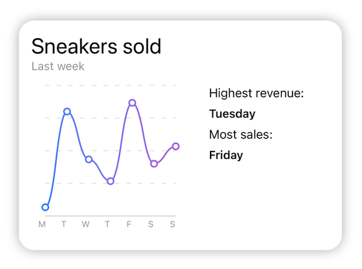
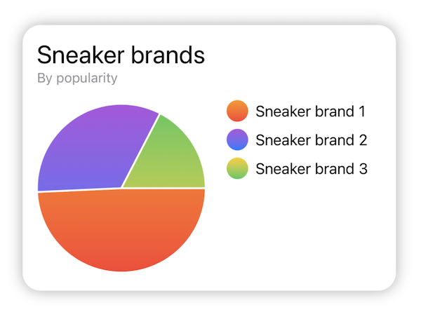

# SwiftUICharts

### Example codes

<p align="left">
 
</p>

```swift
import SwiftUI
import SwiftUICharts

struct DemoView: View {
    var body: some View {
        VStack(alignment: .leading) {
                    Text("Sneakers sold")
                        .font(.title)
                    Text("Last week")
                        .font(.subheadline)
                        .foregroundColor(.gray)
                        .padding(.bottom, 8.0)
                    HStack {
                        AxisLabels {
                            ChartGrid {
                                LineChart()
                                    .showChartMarks(true)
                                    .rangeY(10...40)
                                    .data([12, 34, 23, 18, 36, 22, 26])
                                    .chartStyle(ChartStyle(backgroundColor: .white,
                                                           foregroundColor: ColorGradient(.blue, .purple)))
                            }
                            .setNumberOfHorizontalLines(5)
                            .setNumberOfVerticalLines(0)
                        }
                        .setAxisXLabels([(1, "M"), (2, "T"), (3, "W"),(4, "T"), (5, "F"), (6, "S"), (7, "S")],
                                        range: 1...7)
                        .setColor(.gray)
                        .setFont(.caption2)

                        VStack(alignment: .leading, spacing: 8.0) {
                            Text("Highest revenue:")
                                .font(.callout)
                            Text("Tuesday")
                                .font(.subheadline)
                                .bold()

                            Text("Most sales:")
                                .font(.callout)
                            Text("Friday")
                                .font(.subheadline)
                                .bold()
                            Spacer()
                        }
                        .frame(maxWidth: .infinity)
                    }
                }
                .padding(16.0)
                .background(RoundedRectangle(cornerRadius: 20)
                    .fill(.white)
                    .shadow(radius: 8.0))
                .padding(32)
                .frame(width: 450, height: 350)
    }
}
```

<p align="left">
 
</p>

```swift
import SwiftUI
import SwiftUICharts

struct DemoView: View {
    var body: some View {
        VStack(alignment: .leading) {
                    Text("Sneaker brands")
                        .font(.title)
                    Text("By popularity")
                        .font(.subheadline)
                        .foregroundColor(.gray)
                        .padding(.bottom, 8.0)
                    HStack {
                        AxisLabels {
                            ChartGrid {
                                BarChart()
                                    .data([34, 23, 12])
                                    .chartStyle(ChartStyle(backgroundColor: .white,
                                                           foregroundColor: [ColorGradient(.red, .orange),
                                                                             ColorGradient(.blue, .purple),
                                                                             ColorGradient(.green, .yellow)]))
                            }
                            .setNumberOfHorizontalLines(5)
                            .setNumberOfVerticalLines(0)
                        }
                        .setAxisYLabels([(1, "0"), (2, "100"), (3, "200")],
                                        range: 1...3)
                        .setColor(.gray)
                        .setFont(.caption2)

                        VStack(alignment: .leading, spacing: 8.0) {
                            HStack {
                                Circle()
                                    .fill(ColorGradient(.red, .orange).linearGradient(from: .bottom, to: .top))
                                    .frame(width: 24.0, height: 24.0)
                                Text("Sneaker brand 1")
                            }
                            HStack {
                                Circle()
                                    .fill(ColorGradient(.blue, .purple).linearGradient(from: .bottom, to: .top))
                                    .frame(width: 24.0, height: 24.0)
                                Text("Sneaker brand 2")
                            }
                            HStack {
                                Circle()
                                    .fill(ColorGradient(.green, .yellow).linearGradient(from: .bottom, to: .top))
                                    .frame(width: 24.0, height: 24.0)
                                Text("Sneaker brand 3")
                            }
                            Spacer()
                        }
                        .frame(maxWidth: .infinity)
                    }
                }
                .padding(16.0)
                .background(RoundedRectangle(cornerRadius: 20)
                    .fill(.white)
                    .shadow(radius: 8.0))
                .padding(32)
                .frame(width: 450, height: 350)
    }
}
```

<p align="left">
 
</p>

```swift
import SwiftUI
import SwiftUICharts

struct DemoView: View {
    var body: some View {
        VStack(alignment: .leading) {
                    Text("Sneaker brands")
                        .font(.title)
                    Text("By popularity")
                        .font(.subheadline)
                        .foregroundColor(.gray)
                        .padding(.bottom, 8.0)
                    HStack {
                        PieChart()
                            .data([34, 23, 12])
                            .chartStyle(ChartStyle(backgroundColor: .white,
                                                   foregroundColor: [ColorGradient(.red, .orange),
                                                                     ColorGradient(.blue, .purple),
                                                                     ColorGradient(.yellow, .green),]))

                        VStack(alignment: .leading, spacing: 8.0) {
                            HStack {
                                Circle()
                                    .fill(ColorGradient(.red, .orange).linearGradient(from: .bottom, to: .top))
                                    .frame(width: 24.0, height: 24.0)
                                Text("Sneaker brand 1")
                            }
                            HStack {
                                Circle()
                                    .fill(ColorGradient(.blue, .purple).linearGradient(from: .bottom, to: .top))
                                    .frame(width: 24.0, height: 24.0)
                                Text("Sneaker brand 2")
                            }
                            HStack {
                                Circle()
                                    .fill(ColorGradient(.green, .yellow).linearGradient(from: .bottom, to: .top))
                                    .frame(width: 24.0, height: 24.0)
                                Text("Sneaker brand 3")
                            }
                            Spacer()
                        }
                        .frame(maxWidth: .infinity)
                    }
                }
                .padding(16.0)
                .background(RoundedRectangle(cornerRadius: 20)
                    .fill(.white)
                    .shadow(radius: 8.0))
                .padding(32)
                .frame(width: 450, height: 350)
    }
}
```